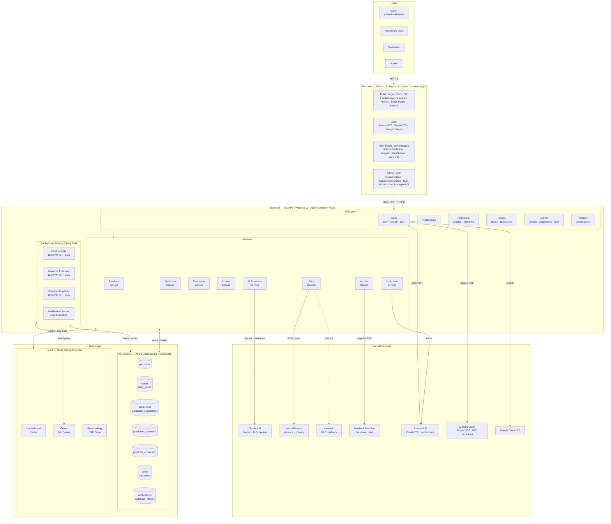
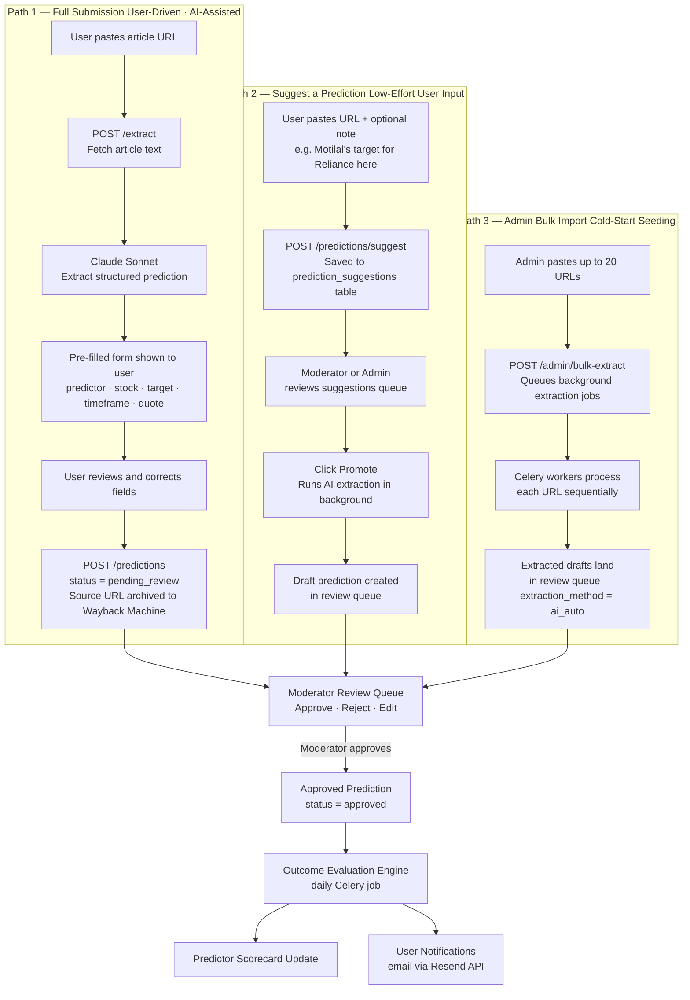
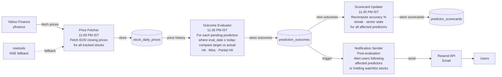
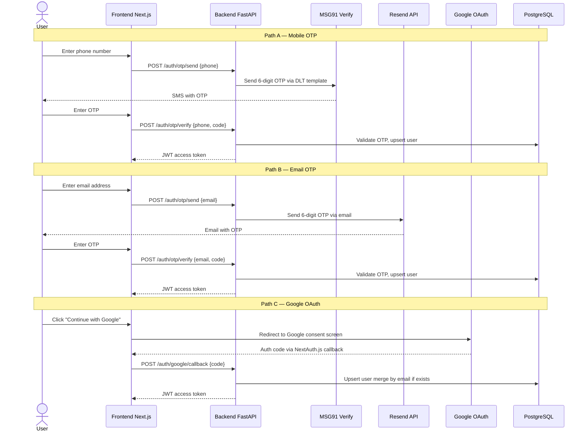
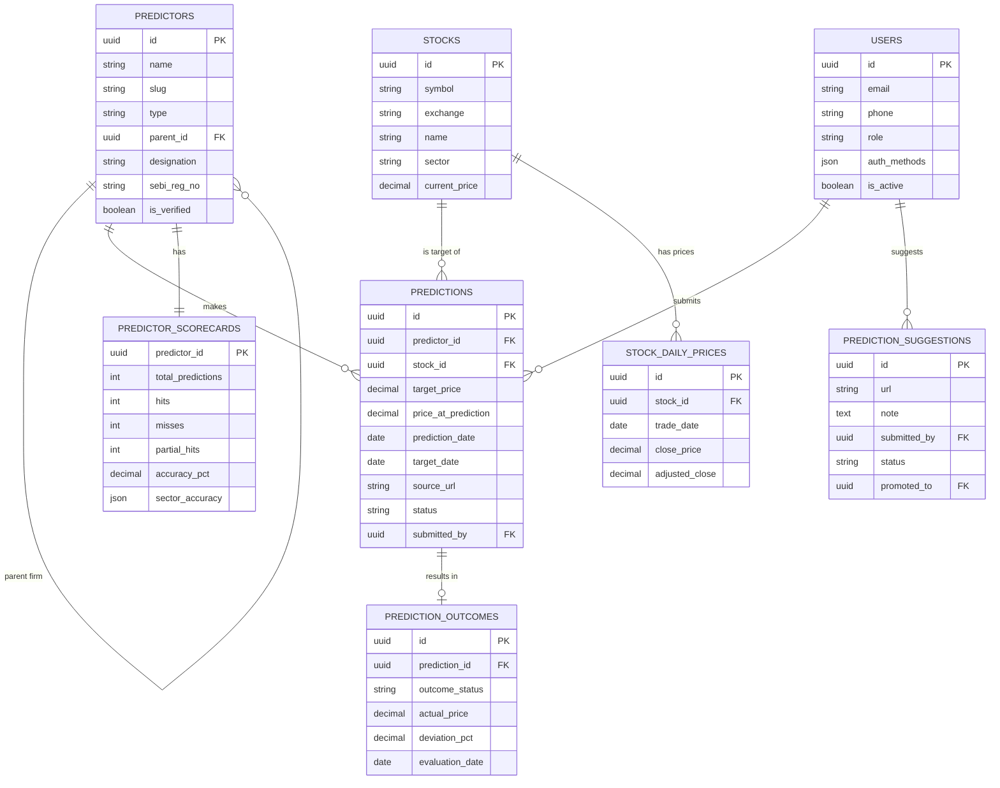

# Enex — System Architecture

> Analyst Prediction Tracker for Indian Equity Markets

---

## 1. System Architecture Overview

High-level view of all components, layers, and their interactions.

---

## 2. Prediction Ingestion Paths

Three distinct paths for predictions to enter the system — all funnel through the moderator review queue before going live.

---

## 3. Nightly Evaluation Pipeline

Sequential background jobs that run after market close each day.

---

## 4. Authentication Flow

Three login paths supported from day one.

---

## 5. Data Model (Entity Relationships)

---

## Component Summary

| Layer | Technology | Hosting |
|-------|-----------|---------|
| Frontend | Next.js 15 · React 19 · Shadcn/ui · TanStack Query | Azure Container Apps |
| Backend API | FastAPI · Python 3.12 · Pydantic v2 · SQLAlchemy 2.0 | Azure Container Apps |
| Database | PostgreSQL (Alembic migrations) | Azure Database for PostgreSQL — Burstable B1ms |
| Cache / Queue | Redis (leaderboard cache · Celery queue · OTP store) | Azure Cache for Redis — Basic C0 |
| Auth | NextAuth.js v5 (Google OAuth) · python-jose (JWT) · MSG91 (mobile OTP) · Resend (email OTP) | — |
| AI Extraction | Claude Sonnet via Anthropic Python SDK | Anthropic API |
| Price Data | yfinance (primary) · nsetools (fallback) | Yahoo Finance / NSE |
| Source Archival | Wayback Machine Save API | Internet Archive |
| Email | Resend API (OTP + notifications) | Resend |
| Monitoring | Sentry (error tracking) | Sentry Cloud |
| **Estimated Cost** | | **$50–90 / month** |
